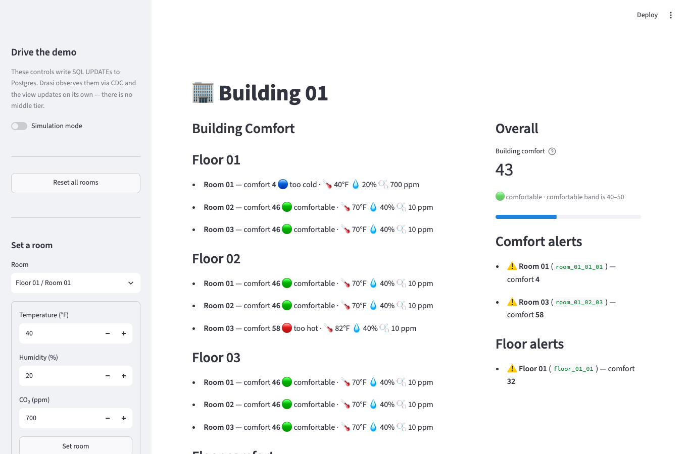

<!-- DO NOT EDIT. Generated from _index.md by scripts/render-tutorials.py. Edit _index.md and run `python3 scripts/render-tutorials.py`. -->

Imagine you manage a building and want to know — the instant it happens — when any room becomes uncomfortable: too hot, too cold, or stuffy with CO2. You don't want to poll sensors on a timer or wire up a stream processor by hand. You just want to describe what "uncomfortable" means and have something watch every room, floor, and the whole building for you, continuously.

This tutorial builds a **Building Comfort** monitoring demo with **`drasi-lib`**, the Python binding that embeds Drasi's continuous-query engine directly in your app. A PostgreSQL database holds a building made of floors and rooms, each room reporting `temperature`, `humidity`, and `co2`. You'll run a single Streamlit program that starts the engine, watch a live UI light up, and then change room readings and see everything react in real time. Instead of a built-in dashboard reaction, the UI is rendered from a **Python reaction** — a callback that receives each query's changes and updates the screen.

**What you'll build:** a Streamlit app that embeds Drasi, connects to PostgreSQL, and reacts to room sensor changes in real time, assembled from Drasi's three core building blocks:

**Sources** → **Continuous Queries** → **Reactions**

- **Sources** — Connect to your data sources
- **Continuous Queries** — Define what changes matter
- **Reactions** — Take action automatically

| Step | What You'll Do | Time |
| ---- | ------------- | ---- |
| **[Step 1: Set Up Your Environment](#step-1-of-4-set-up-your-environment)** | Open the dev container (or install Python + Docker locally) | 5 min |
| **[Step 2: Run the Demo](#step-2-of-4-run-the-demo)** | One command starts PostgreSQL and the Streamlit app | 3 min |
| **[Step 3: Open the UI](#step-3-of-4-open-the-ui)** | Watch comfort levels and alerts live | 2 min |
| **[Step 4: Drive Change](#step-4-of-4-drive-change)** | Set, reset, and simulate rooms from the sidebar — and watch Drasi react instantly | 5 min |
| **[How It Works](#how-it-works)** | Understand the source, the six queries, the synthetic joins, and the Python reaction | 5 min |

> **Before you begin**
>
> - **One process:** the Streamlit app embeds the Drasi engine, so there's just one command to run. It stays in the foreground.
> - **Working directory:** run every command from the tutorial directory (`tutorials/building-comfort/`). The dev container opens there automatically; if you're running locally, `cd tutorials/building-comfort` first.
> - **Command tabs:** commands are shown in tabs (*bash / zsh* and *PowerShell*) — use the one for your shell. The dev container and Codespaces use *bash*.
> - **Ports:** the Streamlit UI is on `8501` and PostgreSQL is published on `5732`.

## Step 1 of 4: Set Up Your Environment
The easiest way to follow this tutorial is the **dev container**, which installs everything for you. You can also run locally if you prefer.

### Option A: Dev Container or GitHub Codespaces (recommended)

1. Open the [`drasi-python`](https://github.com/drasi-project/drasi-python) repository in VS Code and run **Reopen in Container** (or create a **Codespace** from the repo's **Code** menu).
2. When prompted for a configuration, choose **Building Comfort Tutorial (Python)**.
3. Wait for the container to finish. Its setup script installs the tutorial's Python dependencies (`drasi-lib`, `streamlit`, `psycopg`) and the Docker tooling for PostgreSQL.

That's it — skip ahead to [Step 2](#step-2-of-4-run-the-demo).

### Option B: Run Locally

You'll need **Python 3.10+**, **Docker** (for PostgreSQL), and **bash** for the helper scripts (on Windows use Git Bash or WSL, or run the PowerShell scripts). From the repository root, move into the tutorial directory and install the dependencies:

**bash / zsh**

```bash
cd tutorials/building-comfort
python3 -m venv .venv && source .venv/bin/activate
pip install -r requirements.txt
```

**PowerShell**

```powershell
cd tutorials/building-comfort
python -m venv .venv; .venv\Scripts\Activate.ps1
pip install -r requirements.txt
```

`drasi-lib` ships as a prebuilt wheel, so no Rust toolchain is needed. It downloads the Postgres plugins it needs from `ghcr.io/drasi-project` the first time the app runs.

## Step 2 of 4: Run the Demo
In your terminal, start the demo:

**bash / zsh**

```bash
bash scripts/start-demo.sh
```

**PowerShell**

```powershell
powershell -ExecutionPolicy Bypass -File scripts/start-demo.ps1
```

The `start-demo` script does two things: it starts PostgreSQL (seeding one building, three floors, and nine rooms — every room comfortable to begin with) and then launches the Streamlit app.

On first start, the app's embedded engine downloads the plugins it needs (`source/postgres`, `bootstrap/postgres`) from `ghcr.io/drasi-project` and caches them under `~/.drasi/plugins`, connects to the database, and starts the six continuous queries and the reaction. Streamlit prints a URL like the following when it's ready:

```text
You can now view your Streamlit app in your browser.
Local URL: http://localhost:8501
```

Leave this running. Everything else happens in your browser.

> **Stopping and resetting**
>
> Press **Ctrl+C** in the terminal to stop the app. To remove the database container when you're completely done, run `bash scripts/cleanup.sh` (bash) or `powershell -ExecutionPolicy Bypass -File scripts/cleanup.ps1` (PowerShell). Add `--volumes` (bash) or `-RemoveVolumes` (PowerShell) to also delete the data.

## Step 3 of 4: Open the UI
The app renders the building from the Python reaction — there's no separate dashboard server. **Wait until the app has finished starting** (on the first run this takes ~30 seconds while the plugins download and the queries bootstrap), then open it in your browser:

```text
http://localhost:8501
```

In the dev container or Codespaces, port `8501` is forwarded automatically — VS Code shows a notification when the app is ready, and you can also open it from the **Ports** panel.

You'll see the **Building Comfort** UI:

- **Building Comfort** (the main panel) — the building grouped by floor, with each room's comfort level and sensor readings. Every room starts at comfort `46` (comfortable).
- **Overall** — the building's overall comfort level as a number and a meter.
- **Comfort alerts** and **Floor alerts** — empty for now; rooms and floors appear here only when they need attention.
- **Floor comfort** — a table of each floor's comfort level.

The UI refreshes on its own — the reaction updates a shared snapshot the moment the data changes, and Streamlit renders it. Let's make something change.

## Step 4 of 4: Drive Change
Everything you need is in the **sidebar** on the left. Use it to change room readings and watch Drasi react.

> **No middle tier — the controls just write to the database**
>
> The sidebar controls don't call the Drasi engine directly. Each one runs a plain SQL `UPDATE` against PostgreSQL (through `psycopg`) — exactly what an existing building-management app would already do. There's no API to call and no event to publish. Drasi observes the row change through PostgreSQL's logical replication (CDC), re-evaluates the affected queries, and calls the Python reaction, which updates the UI. The set/reset/simulate buttons are a thin front end over a single `UPDATE` statement.

### Set a room

In the sidebar's **Set a room** section, pick a room and give it new readings. Try pushing one out of the comfortable band — for example `temperature = 40`, `humidity = 20`, `co2 = 700` — then press **Set room**.

Within about a second the UI reacts: that room drops out of the comfortable band, the overall meter falls, and entries appear in **Comfort alerts** and **Floor alerts**.

### Reset a room (or all rooms)

Press **Reset this room** to return the selected room to the comfortable defaults (`70 / 40 / 10`), or **Reset all rooms** to return the whole building. The alerts clear and the building returns to green.

### Set custom values

Try partial degradation — make a room too hot without touching CO2. Pick a room and set `temperature = 82`, `humidity = 40`, `co2 = 10`:

That gives `50 + (82-72) + (40-42) + 0 = 58` — above 50, so the room and its floor raise alerts even though humidity and CO2 are fine.

### Let it run hands-free

Flip the **Simulation mode** toggle at the top of the sidebar. Every few seconds it picks a random room and assigns new readings, so comfort levels rise and fall and alerts come and go on their own. Flip it off to stop, then **Reset all rooms** to return everything to comfortable.

## How It Works
The whole demo is a single Streamlit program in `tutorials/building-comfort/`. The engine, queries and reaction live in `demo/`, and `app.py` renders the reaction's state. Here's what each part does.

### The Source

The engine installs the Postgres plugins and adds the source, pointing it at the tutorial database:

```python
await drasi.install_plugin("source/postgres")
await drasi.install_plugin("bootstrap/postgres")
await drasi.start()

await drasi.add_source(
    "postgres",
    "db",
    {
        **POSTGRES,  # host, port, user, password, database
        "sslMode": "prefer",
        # Schema-qualified so the node labels match the queries.
        "tables": ["public.Building", "public.Floor", "public.Room"],
        "tableKeys": [
            {"table": "Building", "keyColumns": ["id"]},
            {"table": "Floor", "keyColumns": ["id"]},
            {"table": "Room", "keyColumns": ["id"]},
        ],
        "slotName": "drasi_building_comfort_slot",
        "publicationName": "drasi_building_comfort_pub",
    },
    bootstrap={"kind": "postgres", **POSTGRES},
)
```

The source uses **logical replication (CDC)** to stream changes from the `Building`, `Floor`, and `Room` tables. `tableKeys` tells Drasi the primary key of each table so it can track row identity across changes. The `bootstrap` provider loads the rows that already exist when the query starts; after that, every `UPDATE` the UI makes flows to Drasi as a change. The table names are PascalCase so the node labels Drasi sees match the queries exactly: `(r:Room)`, `(f:Floor)`, `(b:Building)`. For every option the source accepts, see [Configure the PostgreSQL Source](https://drasi.io/reference/sources/postgresql/).

### The Continuous Queries

Each query computes a **comfort level** with the same formula. A value between **40 and 50** is comfortable; the seed values (70°F, 40%, 10 ppm) give `50 + (70-72) + (40-42) + 0 = 46`.

```cypher
floor( 50 + (r.temperature - 72) + (r.humidity - 42)
      + CASE WHEN r.co2 > 500 THEN (r.co2 - 500) / 25 ELSE 0 END )
```

There are six queries:

| Query | What it returns |
| ----- | --------------- |
| `building-comfort-ui` | One row per room with its comfort level — the feed that drives the building view |
| `building-comfort-level-calc` | The building's overall comfort level |
| `floor-comfort-level-calc` | Each floor's average comfort level |
| `room-alert` | Only the rooms whose comfort is outside 40–50 |
| `floor-alert` | Only the floors whose average comfort is outside 40–50 |
| `building-alert` | The building, when its overall comfort is outside 40–50 |

#### Synthetic joins connect the entities

PostgreSQL knows `Room.floor_id` references `Floor.id` through a foreign key, but Drasi doesn't read foreign keys. Instead, each query **declares** the relationships it needs as synthetic joins, so the Cypher can walk from room to floor to building. In `drasi-lib` a join is a plain mapping passed to `add_query`:

```python
PART_OF_FLOOR = {
    "id": "PART_OF_FLOOR",
    "keys": [
        {"label": "Room", "property": "floor_id"},
        {"label": "Floor", "property": "id"},
    ],
}
PART_OF_BUILDING = {
    "id": "PART_OF_BUILDING",
    "keys": [
        {"label": "Floor", "property": "building_id"},
        {"label": "Building", "property": "id"},
    ],
}

await drasi.add_query(
    "building-comfort-ui", CYPHER, ["db"], joins=[PART_OF_FLOOR, PART_OF_BUILDING]
)
```

With those joins declared, a query can match the whole hierarchy:

```cypher
MATCH (r:Room)-[:PART_OF_FLOOR]->(f:Floor)-[:PART_OF_BUILDING]->(b:Building)
```

#### Aggregating up the hierarchy

Half of the queries don't just read rooms — they **roll comfort levels up** the building. In a Continuous Query, an aggregate such as `avg()` inside a `WITH` groups by whatever non-aggregated values travel alongside it, exactly like SQL's `GROUP BY`.

**One stage — average a floor's rooms.** `floor-comfort-level-calc` keeps the floor `f` in the `WITH`, so `avg()` produces one value per floor:

```cypher
WITH f, floor( 50 + (r.temperature - 72) + ... ) AS RoomComfortLevel
WITH f, avg(RoomComfortLevel) AS ComfortLevel
RETURN f.id AS FloorId, ComfortLevel
```

**Two stages — average the averages.** `building-alert` aggregates twice. Carrying `f, b` groups the first `avg()` by floor; dropping `f` from the next `WITH` widens the grouping so the second `avg()` rolls the floor averages up into a single building level:

```cypher
WITH f, b, avg(RoomComfortLevel) AS FloorComfortLevel   // rooms  -> floor
WITH b,    avg(FloorComfortLevel) AS ComfortLevel        // floors -> building
```

**Filtering on an aggregate.** The `floor-alert` and `building-alert` queries place a `WHERE` *after* the aggregation — like SQL's `HAVING` — so a floor or the building only shows up while its average is outside the comfortable band:

```cypher
WITH f, avg(RoomComfortLevel) AS ComfortLevel
WHERE ComfortLevel < 40 OR ComfortLevel > 50
RETURN f.id AS FloorId, ComfortLevel
```

Because these are *continuous* queries, the aggregates are maintained **incrementally**: when one room's reading changes, Drasi recomputes only the affected floor and building averages and emits just that change — it never rescans every room.

### The Python Reaction

This is where the Python demo differs from a built-in dashboard. Instead of configuring a dashboard reaction, we register a **Python reaction** — a plain callback subscribed to all six queries. Each time a query's result set changes, Drasi calls it with the query id and the diffs, and the callback updates a thread-safe snapshot:

```python
def on_results(event):
    query_id = event["query_id"]
    key = KEY_FIELDS[query_id]  # "RoomId", "FloorId" or "BuildingId"
    with lock:
        store = results[query_id]  # the UI reads this snapshot
        for diff in event["results"]:
            row = diff.get("data") or diff.get("after")
            if diff["type"] == "DELETE":
                store.pop(row[key], None)
            else:  # ADD or UPDATE: upsert by row identity
                store[row[key]] = row


await drasi.add_python_reaction("ui", ALL_QUERY_IDS, on_results)
```

Every diff carries the affected row in `data` (for an `UPDATE` it equals `after`), so the snapshot is kept by row identity — upsert on `ADD`/`UPDATE`, drop on `DELETE`. The `type` is one of `ADD`, `UPDATE`, or `DELETE`. This works the same for the per-room queries and the aggregate floor/building queries, which emit an `UPDATE` as their average changes. See [Python reactions](../../guides/python-reactions/) for the full callback contract.

### Embedding the engine in Streamlit

Streamlit re-runs its script top to bottom on every interaction, which doesn't suit a long-lived async engine. So the engine runs on its own asyncio event loop in a **background daemon thread**, created exactly once with `@st.cache_resource` and shared across every browser session:

```python
@st.cache_resource
def get_engine():
    engine = ComfortEngine()  # spins up the background loop + Drasi
    engine.wait_ready()
    return engine
```

Each run, `app.py` reads `engine.snapshot()` and renders the building, the meter, the floor table and the alert lists. A one-and-a-half-second auto-refresh keeps the view live. Because the reaction only updates the snapshot when a query actually changes, the UI reflects each `UPDATE` the moment it lands — no polling of the database.

The centerpiece building panel is just a loop over the `building-comfort-ui` rows, grouped by floor, picking a status emoji from each room's comfort level:

```python
for floor_name in sorted(by_floor):
    st.markdown(f"### {floor_name}")
    for room in by_floor[floor_name]:
        emoji, label = comfort_status(room["ComfortLevel"])
        st.markdown(
            f"- **{room['RoomName']}** — comfort **{room['ComfortLevel']}** {emoji} {label}"
        )
```

And the reaction renders it live:



### Other ways to consume a query

A Python reaction is the most direct way to turn query changes into a UI, but it isn't the only option `drasi-lib` gives you:

- **Stream the changes** with `async for event in await drasi.query_results("room-alert")` and drive any front end you like. See [Streaming results](../../guides/streaming/).
- **Reuse a published reaction** such as the dashboard reaction plugin, exactly as the [Postgres dashboard example](../../examples/postgres-dashboard/) does — no UI code at all.

Because Drasi emits only what *changed* — never the full result set — whichever you choose stays live without polling.

## Clean Up
When you're finished, stop the app with **Ctrl+C** in the terminal, then remove the database container:

**bash / zsh**

```bash
# Stop containers, keep data
bash scripts/cleanup.sh

# Stop containers and delete the data volume
bash scripts/cleanup.sh --volumes
```

**PowerShell**

```powershell
# Stop containers, keep data
powershell -ExecutionPolicy Bypass -File scripts/cleanup.ps1

# Stop containers and delete the data volume
powershell -ExecutionPolicy Bypass -File scripts/cleanup.ps1 -RemoveVolumes
```

## What You Learned
- **Sources** connect Drasi to live data — here, PostgreSQL via Change Data Capture, configured in a few lines of Python.
- **Continuous Queries** with **synthetic joins** let you model relationships (room → floor → building) and compute derived values (comfort levels) that stay current automatically.
- **Reactions** turn query changes into action. A **Python reaction** gave you a live UI from a callback and a snapshot — no bespoke web server, and complete control over the rendering.
- Because Drasi emits only what *changed*, everything updates the instant the data does, with no polling.

From here, try editing the comfort formula or the layout in `app.py`, adding a new alert query, or pointing the source at your own database.
