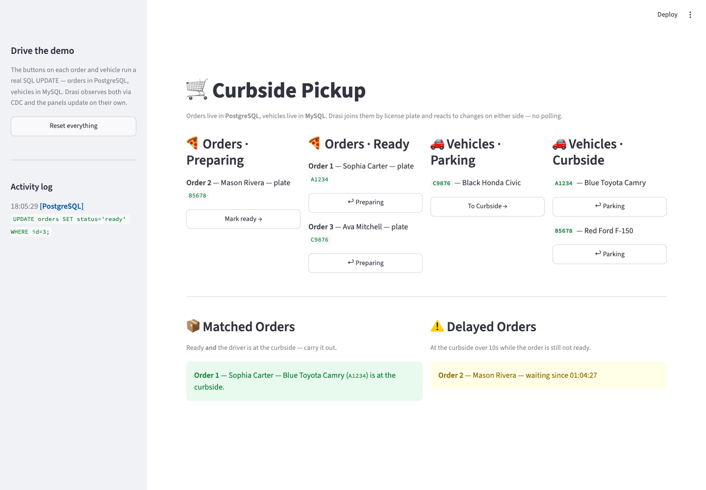

<!-- DO NOT EDIT. Generated from _index.md by scripts/render-tutorials.py. Edit _index.md and run `python3 scripts/render-tutorials.py`. -->

Imagine a store running curbside pickup. The **retail team** manages customer orders in one database and marks an order *ready* when it's prepared. Independently, the **physical operations team** tracks pickup vehicles in *another* database, and a driver sets their location to *Curbside* when they arrive. The two systems never talk to each other.

You want a single live view with six panels:

- an **Orders · Preparing** panel and an **Orders · Ready** panel, so an order visibly moves from one to the other the moment it's marked *ready*,
- a **Vehicles · Parking** panel and a **Vehicles · Curbside** panel, so a car moves between them as the driver pulls up, plus the two situations that matter:
- a **Matched Orders** panel that lights up the instant an order is *ready* **and** its driver is at the curbside, so staff know exactly which order to carry out, and
- a **Delayed Orders** panel that flags drivers who have been waiting at the curbside too long while their order still isn't ready.

The catch: the orders live in **PostgreSQL** and the vehicles live in **MySQL**, and what you care about — a *ready* order whose driver has *arrived* — only exists when you combine a fact from each. Building this the traditional way means **polling both databases**, and you always end up reactive on one side and blind, between polls, on the other. This tutorial builds it with **`drasi-lib`** instead: two sources, six continuous queries (two of which join across both databases), and a **Python reaction** that renders one [Streamlit](https://streamlit.io/) UI. Drasi watches the change feed of *both* databases at once, so a change on **either** side re-evaluates the join immediately — no polling, no blind side. And rather than a separate dashboard plus a separate console, the **one** Streamlit page both shows the six panels *and* has the buttons that drive the changes.

**Sources** → **Continuous Queries** → **Reactions**

- **Sources** — Connect to your data sources
- **Continuous Queries** — Define what changes matter
- **Reactions** — Take action automatically

| Step | What You'll Do |
| ---- | ------------- |
| **[Step 1: Set Up Your Environment](#step-1-of-4-set-up-your-environment)** | Open the dev container (or install Python + Docker locally) |
| **[Step 2: Run the Demo](#step-2-of-4-run-the-demo)** | One command starts both databases and the Streamlit app |
| **[Step 3: Open the UI](#step-3-of-4-open-the-ui)** | Watch all six panels update live |
| **[Step 4: Drive Change](#step-4-of-4-drive-change)** | Use the buttons in the UI to change orders and vehicles, and watch Drasi react |
| **[How It Works](#how-it-works)** | Understand the two sources, the cross-database join, and the six queries |

> **Before you begin**
>
> - **One process:** the Streamlit app embeds the Drasi engine, so a single command runs everything. It stays in the foreground and you drive changes from your **browser**.
> - **Working directory:** run every command from the tutorial directory (`tutorials/curbside-pickup/`). The dev container opens there automatically; if you're running locally, `cd tutorials/curbside-pickup` first.
> - **Command tabs:** commands are shown in tabs (*bash / zsh* and *PowerShell*). Use the one for your shell. The dev container and Codespaces use *bash*.
> - **Ports:** the Streamlit UI is on `8501`, PostgreSQL is published on `5742`, and MySQL on `3309`.

## Step 1 of 4: Set Up Your Environment
This tutorial needs **Docker** (it runs PostgreSQL and MySQL) and **Python 3.10+**. The easiest way to get everything is the **dev container**.

### Option A: Dev Container or GitHub Codespaces (recommended)

1. Open the [`drasi-python`](https://github.com/drasi-project/drasi-python) repository in VS Code and run **Reopen in Container** (or create a **Codespace** from the repo's **Code** menu).
2. When prompted for a configuration, choose **Curbside Pickup Tutorial (Python)**.
3. Wait for the container to finish. Its setup script installs the tutorial's Python dependencies and the Docker tooling for the two databases.

That's it. Skip ahead to [Step 2](#step-2-of-4-run-the-demo).

### Option B: Run Locally

You'll need **Python 3.10+**, **Docker**, and **bash** for the helper scripts (on Windows use Git Bash or WSL, or run the PowerShell scripts). From the repository root, move into the tutorial directory and install the dependencies:

**bash / zsh**

```bash
cd tutorials/curbside-pickup
python3 -m venv .venv && source .venv/bin/activate
pip install -r requirements.txt
```

**PowerShell**

```powershell
cd tutorials/curbside-pickup
python -m venv .venv; .venv\Scripts\Activate.ps1
pip install -r requirements.txt
```

`drasi-lib` ships as a prebuilt wheel, so no Rust toolchain is needed. It downloads the Postgres and MySQL plugins it needs from `ghcr.io/drasi-project` the first time the app runs.

## Step 2 of 4: Run the Demo
Start the demo:

**bash / zsh**

```bash
bash scripts/start-demo.sh
```

**PowerShell**

```powershell
powershell -ExecutionPolicy Bypass -File scripts/start-demo.ps1
```

The `start-demo` script does two things:

1. **Starts both databases.** PostgreSQL comes up with logical replication enabled and the `orders` table seeded (three orders, all *preparing*). MySQL comes up with **ROW-based binary logging** and GTID mode enabled and the `vehicles` table seeded (three vehicles, all *Parking*) — the plates match the orders.
2. **Launches the Streamlit app**, which embeds the Drasi engine.

On first start, the app's embedded engine downloads the plugins it needs (`source/postgres`, `bootstrap/postgres`, `source/mysql`, `bootstrap/mysql`) from `ghcr.io/drasi-project`, connects to both databases, bootstraps the existing rows, starts the six continuous queries, and registers the reaction. Streamlit prints a URL like the following when it's ready:

```text
Local URL: http://localhost:8501
```

Leave this running. Everything else happens in your **browser**.

> **Stopping and resetting**
>
> Press **Ctrl+C** in the terminal to stop the app. To remove the database containers when you're completely done, run `bash scripts/cleanup.sh` (bash) or `powershell -ExecutionPolicy Bypass -File scripts/cleanup.ps1` (PowerShell). Add `--volumes` (bash) or `-RemoveVolumes` (PowerShell) to also delete the data.

## Step 3 of 4: Open the UI
The app renders everything from the Python reaction — there's no separate dashboard server and no separate console. **Wait until the app has finished starting** (the first run takes a little longer while the plugins download), then open it in your browser:

```text
http://localhost:8501
```

In the dev container or Codespaces, port `8501` is forwarded automatically. You'll see the **Curbside Pickup** UI with six panels:

- 🍕 **Orders · Preparing** and 🍕 **Orders · Ready** — every order in PostgreSQL, split by status. Each row has a button to move it.
- 🚗 **Vehicles · Parking** and 🚗 **Vehicles · Curbside** — every vehicle in MySQL, split by location. Each row has a button to move it.
- 📦 **Matched Orders** — orders that are *ready* whose driver is at the *Curbside* (the `delivery` query).
- ⚠️ **Delayed Orders** — drivers who have waited at the curbside for more than 10 seconds while their order is still being prepared (the `delay` query).

At bootstrap all three orders are *preparing* and all three vehicles are in *Parking*, so those two panels list every row while their **Ready** and **Curbside** counterparts start empty. The **Matched** and **Delayed** panels also start **empty** and fill in as you drive changes. The **sidebar** has a **Reset** button and a live, color-coded **activity log** of the SQL each button runs.

## Step 4 of 4: Drive Change
> **No middle tier — the buttons just write to a database**
>
> Each button on an order or vehicle runs a single SQL `UPDATE` — orders in PostgreSQL (via `psycopg`), vehicles in MySQL (via `PyMySQL`) — exactly what a real retail or physical-operations app would run. There's no API to call and no event to publish. Drasi observes the PostgreSQL change through logical replication and the MySQL change through the binary log, re-evaluates the affected queries (including the cross-database join), and calls the Python reaction, which updates the panels. The sidebar's **activity log** shows each statement and which database it hit.

### Trigger a delivery

In the 🍕 **Orders · Preparing** panel, press **Mark ready →** on order **1** (Sophia Carter). It immediately leaves *Preparing* and appears in 🍕 **Orders · Ready**. Now, in the 🚗 **Vehicles · Parking** panel, press **To Curbside →** on vehicle **A1234**.

The vehicle jumps to 🚗 **Vehicles · Curbside**, and within about a second the 📦 **Matched Orders** panel reacts: order **1** appears with its driver and vehicle. Nothing polled anything — Drasi saw the PostgreSQL change and the MySQL change and re-evaluated the cross-database join. Send the vehicle back with **↩ Parking** and the row disappears from **Matched Orders**.

### Trigger a delay

Now reproduce the *other* scenario. Pick a vehicle whose order is **not** ready — say **B5678** (Mason Rivera) — and press **To Curbside →**, but **leave order 2 as *preparing***. Nothing happens immediately. After **10 seconds** the ⚠️ **Delayed Orders** panel lights up: order **2** appears, flagging that the driver has been waiting too long.

This is the interesting one. Drasi doesn't poll to find slow orders — the **continuous query schedules its own future re-evaluation** for the moment the 10-second threshold is crossed, and fires exactly then. If you mark the order *ready* (or send the driver back to *Parking*) before the 10 seconds elapse, the alert never appears.

### Reset

Press **Reset everything** in the sidebar to return to the starting state (all orders *preparing*, all vehicles *Parking*).

## How It Works
The demo is two files in `tutorials/curbside-pickup/`: **`engine.py`** holds the two sources, the six queries, and the `CurbsideEngine` (its Python reaction and the SQL writes); **`app.py`** renders the reaction's state and hosts the controls. The [complete `engine.py`](#putting-it-all-together) is at the end.

### Two Sources

The queries join data from two different databases, so the engine adds two sources. Installing the plugins and adding the sources is a few lines of Python:

```python
for plugin in ("source/postgres", "bootstrap/postgres", "source/mysql", "bootstrap/mysql"):
    await drasi.install_plugin(plugin)
await drasi.start()

# PostgreSQL holds the orders and streams changes via logical replication (CDC).
await drasi.add_source(
    "postgres",
    "retail-ops",
    {
        **POSTGRES,
        "sslMode": "prefer",
        "tables": ["public.orders"],
        "tableKeys": [{"table": "orders", "keyColumns": ["id"]}],
        "slotName": "drasi_curbside_slot",
        "publicationName": "drasi_curbside_pub",
    },
    bootstrap={"kind": "postgres", **POSTGRES},
)

# MySQL holds the vehicles and streams changes via its binary log (binlog).
await drasi.add_source(
    "mysql",
    "physical-ops",
    {
        **MYSQL,
        "sslMode": "disabled",
        "tables": ["vehicles"],
        "tableKeys": [{"table": "vehicles", "keyColumns": ["plate"]}],
    },
    bootstrap={
        "kind": "mysql",
        **MYSQL,
        "tables": ["vehicles"],
        "tableKeys": [{"table": "vehicles", "keyColumns": ["plate"]}],
    },
)
```

The MySQL container is started with ROW-based logging, full row images/metadata and GTID mode (see `database/docker-compose.yml`), and `database/mysql-init.sql` grants the Drasi user the replication privileges it needs to read the binlog. Each table row becomes a graph node: `orders` rows become `(o:orders)` and `vehicles` rows become `(v:vehicles)`.

### The Synthetic Join

There is no foreign key between the two databases — they're completely separate systems. Drasi creates the relationship in the query with a **synthetic join**, matching a vehicle to an order whenever their `plate` values are equal:

```python
PICKUP_BY = {
    "id": "PICKUP_BY",
    "keys": [
        {"label": "vehicles", "property": "plate"},
        {"label": "orders", "property": "plate"},
    ],
}
```

The `delivery` and `delay` queries read from **both** sources and pass `joins=[PICKUP_BY]` to `add_query`, then walk `(o:orders)-[:PICKUP_BY]->(v:vehicles)` as if it were a real graph edge — across two different databases.

### The Six Continuous Queries

Four are simple single-source lists, filtered by state, that feed the split **Orders** and **Vehicles** panels — because each matches only part of a table, a row leaves one query's result and joins the other's the instant its status or location changes:

```cypher
MATCH (o:orders)
WHERE o.status <> 'ready'          // orders-ready uses: o.status = 'ready'
RETURN o.id AS id, o.customer_name AS customerName, o.plate AS plate
```

The other two join across both databases. **`delivery`** returns an order whenever it is *ready* and its driver's vehicle is at the *Curbside*:

```cypher
MATCH (o:orders)-[:PICKUP_BY]->(v:vehicles)
WHERE o.status = 'ready' AND v.location = 'Curbside'
RETURN o.id AS id, o.customer_name AS customerName, o.plate AS vehicleId, v.make AS vehicleMake
```

**`delay`** returns an order whose driver has been at the *Curbside* for more than 10 seconds while the order still isn't *ready*. It uses **`drasi.trueFor`**, which schedules a future re-evaluation and fires the moment the condition has held for the given duration, so the order appears exactly when the 10-second threshold is crossed:

```cypher
MATCH (o:orders)-[:PICKUP_BY]->(v:vehicles)
WHERE o.status <> 'ready'
  AND drasi.trueFor(v.location = 'Curbside', duration({ seconds: 10 }))
RETURN o.id AS orderId, o.customer_name AS customerName,
       drasi.changeDateTime(v) AS waitingSinceTimestamp
```

> **How the timing works**
>
> Both the PostgreSQL and MySQL sources stamp every change with the wall-clock time it happened, which `drasi.changeDateTime()` exposes. `drasi.trueFor` uses that timestamp to anchor its 10-second timer — so the delay query fires exactly when a curbside vehicle has waited long enough — with no extra timestamp columns or application bookkeeping. The `delivery` query uses `drasi.listMax([drasi.changeDateTime(o), drasi.changeDateTime(v)])` to report whichever of the two changes happened later.

### The Python Reaction

A single **Python reaction** subscribes to all six queries. Each time a query's result set changes — including the delayed re-evaluation the `delay` query schedules — Drasi calls it with the query id and the diffs, and the callback updates a thread-safe snapshot the UI reads:

```python
def on_results(event):
    query = QUERIES_BY_ID[event["query_id"]]
    with lock:
        store = snapshot[query.id]  # this query's rows, keyed by id
        for diff in event["results"]:
            match diff:
                case {"type": "DELETE", "data": dict() as row}:
                    store.pop(row[query.key], None)
                case {"after": dict() as row} | {
                    "data": dict() as row
                }:  # ADD / UPDATE / aggregation
                    store[row[query.key]] = row


await drasi.add_python_reaction("ui", [q.id for q in QUERIES], on_results)
```

### One integrated Streamlit UI

The engine runs on its own asyncio event loop in a background daemon thread, created once with `@st.cache_resource`, and `app.py` reads `engine.snapshot()` each run and renders the six panels with a ~1-second auto-refresh. Because it's the same page, the panels can *also* drive the demo: each order and vehicle row has a button that runs the matching `UPDATE`, the sidebar has a **Reset** button, and every write is appended to the activity log the sidebar shows. A `delay` row appearing 10 seconds after you move a vehicle to the curbside is the reaction receiving `drasi.trueFor`'s scheduled re-evaluation — live, with no polling.



## Putting It All Together
The sections above walked through the Drasi side one piece at a time. Here it is assembled into the single `engine.py` — the two sources, the synthetic join, the six queries, and the `CurbsideEngine` that runs them and writes back. `app.py` (the Streamlit UI) imports `CurbsideEngine` and the query ids from it:

```python
import asyncio
import os
import threading
import time
from collections import deque
from dataclasses import dataclass, field
from typing import Any

os.environ.setdefault("RUST_LOG", "warn")  # quiet the engine's INFO logging

import psycopg
import pymysql
from drasi import Drasi

# --- The two sources ---
POSTGRES = {
    "host": os.environ.get("POSTGRES_HOST", "localhost"),
    "port": int(os.environ.get("POSTGRES_PORT", "5742")),
    "database": os.environ.get("POSTGRES_DATABASE", "RetailOperations"),
    "user": os.environ.get("POSTGRES_USER", "drasi_user"),
    "password": os.environ.get("POSTGRES_PASSWORD", "drasi_password"),
}
POSTGRES_SOURCE_CONFIG = {
    **POSTGRES,
    "sslMode": "prefer",
    "tables": ["public.orders"],
    "tableKeys": [{"table": "orders", "keyColumns": ["id"]}],
    "slotName": "drasi_curbside_slot",
    "publicationName": "drasi_curbside_pub",
}

MYSQL = {
    "host": os.environ.get("MYSQL_HOST", "localhost"),
    "port": int(os.environ.get("MYSQL_PORT", "3309")),
    "database": os.environ.get("MYSQL_DATABASE", "PhysicalOperations"),
    "user": os.environ.get("MYSQL_USER", "drasi_user"),
    "password": os.environ.get("MYSQL_PASSWORD", "drasi_password"),
}
MYSQL_SOURCE_CONFIG = {
    **MYSQL,
    "sslMode": "disabled",  # the tutorial container has no TLS
    "tables": ["vehicles"],
    "tableKeys": [{"table": "vehicles", "keyColumns": ["plate"]}],
}
# Each source also takes a bootstrap config, and the UI writes through a psycopg
# (Postgres) and a PyMySQL (MySQL) connection built from the dicts above.

RETAIL_OPS, PHYSICAL_OPS = "retail-ops", "physical-ops"

# The synthetic join: match a vehicle to an order by equal plate, across databases.
PICKUP_BY = {
    "id": "PICKUP_BY",
    "keys": [
        {"label": "vehicles", "property": "plate"},
        {"label": "orders", "property": "plate"},
    ],
}


@dataclass(frozen=True)
class Query:
    id: str
    key: str  # the RETURN column that identifies each row
    sources: list[str]
    cypher: str
    joins: list[dict] = field(default_factory=list)


QUERIES = [
    # Four single-source list queries split orders and vehicles by state. Each has
    # the same shape; orders-preparing is shown here, and orders-ready /
    # vehicles-parking / vehicles-curbside flip the WHERE clause.
    Query(
        id="orders-preparing",
        key="id",
        sources=[RETAIL_OPS],
        cypher="MATCH (o:orders) WHERE o.status <> 'ready' "
        "RETURN o.id AS id, o.customer_name AS customerName, o.plate AS plate",
    ),
    # delivery: an order is ready AND its driver's vehicle is at the curbside.
    Query(
        id="delivery",
        key="id",
        sources=[RETAIL_OPS, PHYSICAL_OPS],
        joins=[PICKUP_BY],
        cypher="""
        MATCH (o:orders)-[:PICKUP_BY]->(v:vehicles)
        WHERE o.status = 'ready' AND v.location = 'Curbside'
        RETURN o.id AS id, o.customer_name AS customerName, o.plate AS vehicleId
        """,
    ),
    # delay: at the curbside over 10s while the order is still not ready.
    Query(
        id="delay",
        key="orderId",
        sources=[RETAIL_OPS, PHYSICAL_OPS],
        joins=[PICKUP_BY],
        cypher="""
        MATCH (o:orders)-[:PICKUP_BY]->(v:vehicles)
        WHERE o.status <> 'ready'
          AND drasi.trueFor(v.location = 'Curbside', duration({ seconds: 10 }))
        RETURN o.id AS orderId, o.customer_name AS customerName,
               drasi.changeDateTime(v) AS waitingSinceTimestamp
        """,
    ),
]


class CurbsideEngine:
    """Runs Drasi over two databases and exposes a thread-safe snapshot."""

    def __init__(self):
        self._lock = threading.Lock()
        self._results = {}  # query id -> {row key -> row}
        self._key_by_id = {q.id: q.key for q in QUERIES}
        self._activity = deque(maxlen=20)  # recent SQL writes for the sidebar
        self._ready = threading.Event()
        self._drasi = None
        # Run the engine on its own event loop in a background thread.
        threading.Thread(target=self._run, daemon=True).start()

    def _run(self):
        loop = asyncio.new_event_loop()
        asyncio.set_event_loop(loop)
        loop.run_until_complete(self._start())
        self._ready.set()
        loop.run_forever()

    async def _start(self):
        self._drasi = await Drasi.create("curbside-pickup")
        for plugin in ("source/postgres", "bootstrap/postgres", "source/mysql", "bootstrap/mysql"):
            await self._drasi.install_plugin(plugin)
        await self._drasi.start()

        await self._drasi.add_source("postgres", RETAIL_OPS, POSTGRES_SOURCE_CONFIG, bootstrap=...)
        await self._drasi.add_source("mysql", PHYSICAL_OPS, MYSQL_SOURCE_CONFIG, bootstrap=...)
        for q in QUERIES:
            await self._drasi.add_query(q.id, q.cypher, q.sources, joins=q.joins or None)
        for q in QUERIES:
            await self._drasi.wait_for_query(q.id)
            rows = await self._drasi.get_query_results(q.id)
            self._results[q.id] = {r[q.key]: r for r in rows}

        await self._drasi.add_python_reaction("ui", [q.id for q in QUERIES], self._on_results)

    def _on_results(self, event):
        key = self._key_by_id[event["query_id"]]
        with self._lock:
            store = self._results.setdefault(event["query_id"], {})
            for diff in event["results"]:
                match diff:
                    case {"type": "DELETE", "data": dict() as row}:
                        store.pop(row[key], None)
                    case {"after": dict() as row} | {"data": dict() as row}:
                        store[row[key]] = row

    def snapshot(self):
        with self._lock:
            return {
                "results": {q: list(s.values()) for q, s in self._results.items()},
                "activity": list(self._activity),
            }

    # set_order_status(id, status) writes to Postgres, set_vehicle_location(plate,
    # location) writes to MySQL, and reset() returns everything to the start.
    # Each records the SQL it ran in the activity log.
```

That's the whole Drasi side in one file: two databases joined by plate, six continuous queries (one temporal), and a reaction that keeps a snapshot the UI renders and drives.

## Clean Up
When you're finished, stop the app with **Ctrl+C** in the terminal, then remove the database containers:

**bash / zsh**

```bash
# Stop containers, keep data
bash scripts/cleanup.sh

# Stop containers and delete the data volumes
bash scripts/cleanup.sh --volumes
```

**PowerShell**

```powershell
# Stop containers, keep data
powershell -ExecutionPolicy Bypass -File scripts/cleanup.ps1

# Stop containers and delete the data volumes
powershell -ExecutionPolicy Bypass -File scripts/cleanup.ps1 -RemoveVolumes
```

## What You Learned
- **Sources** connect Drasi to live data — here, **two** databases at once, PostgreSQL via logical replication and MySQL via the binary log.
- **Continuous Queries** with a **synthetic join** relate rows across those two databases (order ↔ vehicle by plate), and a **temporal** query (`drasi.trueFor`) fires exactly when a condition has held long enough — no polling, no bookkeeping.
- A **Python reaction** turned all six queries into one live UI, and because it's a Streamlit page, the same UI hosts the controls that drive the changes — no dashboard reaction and no separate console.
- Because Drasi emits only what *changed*, every panel updates the instant the data does, whichever database changed.

From here, try changing the delay threshold, adding an order/vehicle, or pointing the sources at your own databases.
